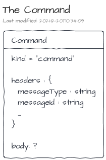
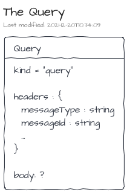
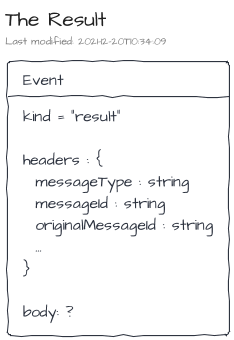
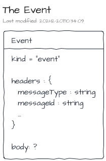

# Messages

> The definition of the messages is part of the NPM package [@tmorin/ceb-messaging-core](https://www.npmjs.com/package/@tmorin/ceb-messaging-core).

## Anatomy of a message

A message is a data structure composed of three properties: `kind`, `headers` and `body`.

| Property  | Description                                                                                                                                                                                                |
|-----------|------------------------------------------------------------------------------------------------------------------------------------------------------------------------------------------------------------|
| `kind`    | Provide the intention of the message producer.                                                                                                                                                             |
| `headers` | Provide information to the messaging system to handle the message. The headers are a set of arbitrary key/value entries. Two entries are expected for each message: the `messageType` and the `messageId`. |
| `body`    | An arbitrary set of information expected by the receiver.                                                                                                                                                  |


## The commands

A Command is a data structure matching the Message one.

| Property              | Description                                                                  |
|-----------------------|------------------------------------------------------------------------------|
| `kind`                | The value is always `command`.                                               |
| `headers.messageType` | Help the messaging system to route the message to the right command handler. |



Commands are handled by Command Handlers.
By convention, a command type should only be processed by one Command Handler implementation and process only once.
The main purpose of a command handler is to interact with model artifacts to mutate the state of a system.
The underlying side effects can be described by a Result and/or a set of Events.

## The queries

A Query is a data structure matching the Message one.

| Property              | Description                                                                |
|-----------------------|----------------------------------------------------------------------------|
| `kind`                | The value is always `query`.                                               |
| `headers.messageType` | Help the messaging system to route the message to the right query handler. |



Queries are handled by Query Handlers.
By convention, a query type can be processed by different Command Handlers implementations and process more than once.
The main purpose of a query handler is to interact with model artifacts to gather data and build a view of the system's state.
The view is finally sent back to the requester within a Result.

## The results

A Result is a data structure matching the Message one.

| Property                    | Description                                                                                                                                |
|-----------------------------|--------------------------------------------------------------------------------------------------------------------------------------------|
| `kind`                      | The value is always `result`.                                                                                                              |
| `headers.messageType`       | Help requester to handle the result, i.e. success vs failure.                                                                              |
| `headers.originalMessageId` | It's the `messageId` of the related command or query. It helps the requester to distinguish to which command or query a result belongs to. |



## The events

An Event is a data structure matching the Message one.

| Property              | Description                                                                  |
|-----------------------|------------------------------------------------------------------------------|
| `kind`                | The value is always `event`.                                                 |
| `headers.messageType` | Help the messaging system to route the message to the right event listeners. |



Events are listened by Event Listeners.
By convention, an event type can be listened by many Event listeners.
The main purpose of an event listener is to react on the event.

## Message Construction

Messages are simple vanilla JavaScript objects.
For instance to create a command `Greeting`, the following snippet is enough.
```javascript
const greetingCmd = {
  kind: "command",
  headers: {
    messageType: "Greeting",
    messageId: "command-0"
  },
  body: "Hello, World!"
}
```

However, manual creation of messages is error-prone and not really DRY.
Therefore, a _builder_ is provided to, at least, build messages which are _technically_ valid.

Creation of commands using the MessageBuilder:
```typescript
{{#include messages-construction_commands.ts}}
```

Creation of queries using the MessageBuilder:
```typescript
{{#include messages-construction_queries.ts}}
```

Creation of events using the MessageBuilder:
```typescript
{{#include messages-construction_events.ts}}
```

Creation of results using the MessageBuilder:
```typescript
{{#include messages-construction_results.ts}}
```
